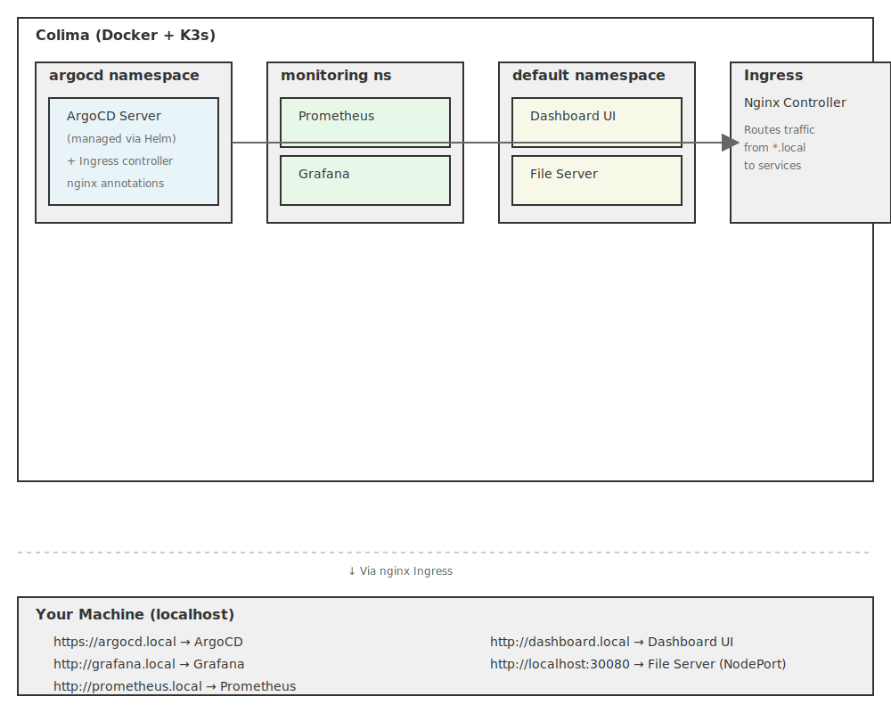

# Local Kubernetes Cluster - Infrastructure

ArgoCD infrastructure and configuration for a local K8s cluster. Pair with [`local-k8s-apps`](https://github.com/mvs5465/local-k8s-apps) repo for application definitions.

## Architecture



## Two-Repo Architecture

This project uses a **separate repos** pattern to prevent the chicken-and-egg problem:

**This Repo** (`local-k8s-argocd`):
- ArgoCD infrastructure and configuration
- Stable, rarely changes
- Contains: AppProject, root applications, ArgoCD install
- Watched by ArgoCD on main branch

**Companion Repo** ([`local-k8s-apps`](https://github.com/mvs5465/local-k8s-apps)):
- Application definitions (Prometheus, Grafana, Dashboard, File Server)
- Where active development happens
- Root applications point here and auto-discover
- Can safely test on feature branches

This separation prevents the problem where ArgoCD needs to watch feature branches to test changes to itself.

## Tech Stack

- **Kubernetes**: k3s (via Colima)
- **Container Runtime**: Docker (via Colima)
- **GitOps**: ArgoCD (app-of-apps pattern with two repos)
- **Monitoring**: Prometheus + Grafana
- **File Server**: Nginx
- **Dashboard**: Nginx with HTML dashboard

## Setup

### Prerequisites

```bash
brew install colima docker kubectl
colima start --kubernetes
```

### Installation

```bash
# Create files directory on Colima (required for fileserver pod)
colima ssh -- mkdir -p /tmp/files

# Install cluster
cd ~/projects/local-k8s-argocd
chmod +x quick-start.sh
./quick-start.sh
```

This installs ArgoCD in the cluster. The `/tmp/files` directory on the Colima node is where the file server reads files from.

## Services

All services are accessible via hostname routing (requires `/etc/hosts` entries):

| Service | URL |
|---------|-----|
| ArgoCD | https://argocd.local |
| Grafana | http://grafana.local |
| Prometheus | http://prometheus.local |
| Dashboard UI | http://dashboard.local |
| File Server | http://localhost:30080 |

### Setup Hostname Routing

Add these entries to your `/etc/hosts` file:

```
127.0.0.1 argocd.local
127.0.0.1 grafana.local
127.0.0.1 prometheus.local
127.0.0.1 dashboard.local
```

## Deploying Applications

Create a git repo with Kubernetes manifests and add as ArgoCD Application in the UI:

1. Click "+ New App"
2. Set repository URL to your repo
3. Set path to manifests directory
4. Click Create

ArgoCD will sync your app to the cluster and keep it in sync on git push.

## Project Structure

```
manifests/
├── grafana-app.yaml          # ArgoCD app for Prometheus Helm chart
├── prometheus-app.yaml       # ArgoCD app for Grafana Helm chart
├── dashboard-ui.yaml         # Nginx dashboard linking all services
└── fileserver.yaml           # Nginx file server (hostPath volume)

quick-start.sh                # Installs ArgoCD and applies manifests
CLAUDE.md                      # Project instructions for Claude Code
README.md                      # This file
```

## Troubleshooting

Check cluster status:
```bash
kubectl get nodes
kubectl get pods -A
```

View ArgoCD logs:
```bash
kubectl logs -n argocd -l app.kubernetes.io/name=argocd-server
```

Restart Colima:
```bash
colima stop && colima start --kubernetes
```
